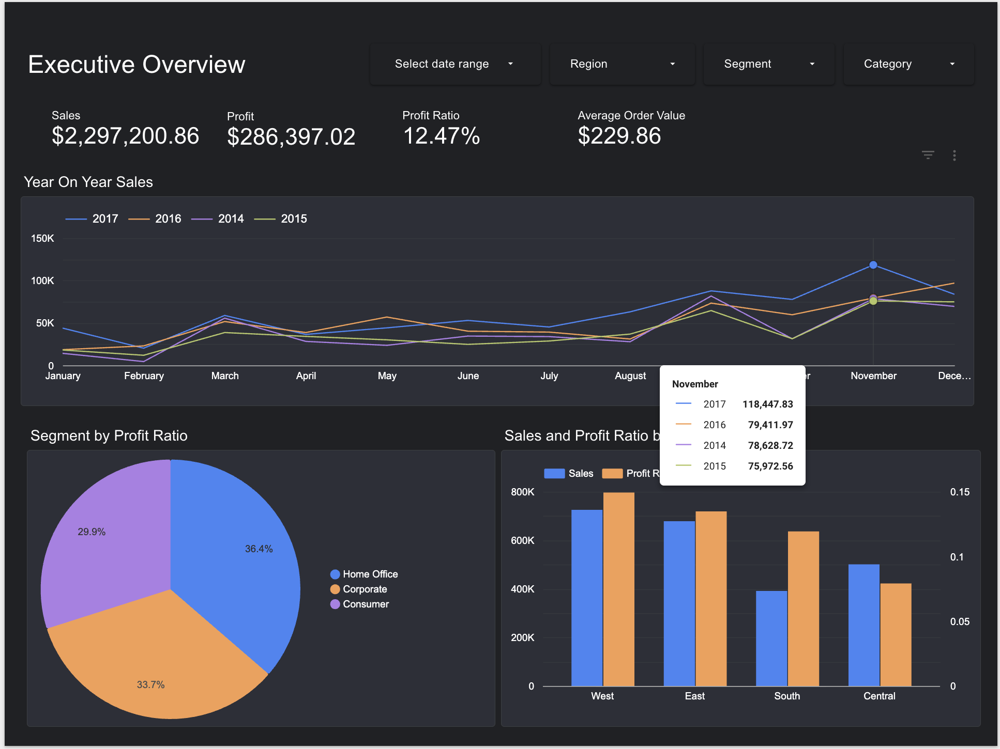
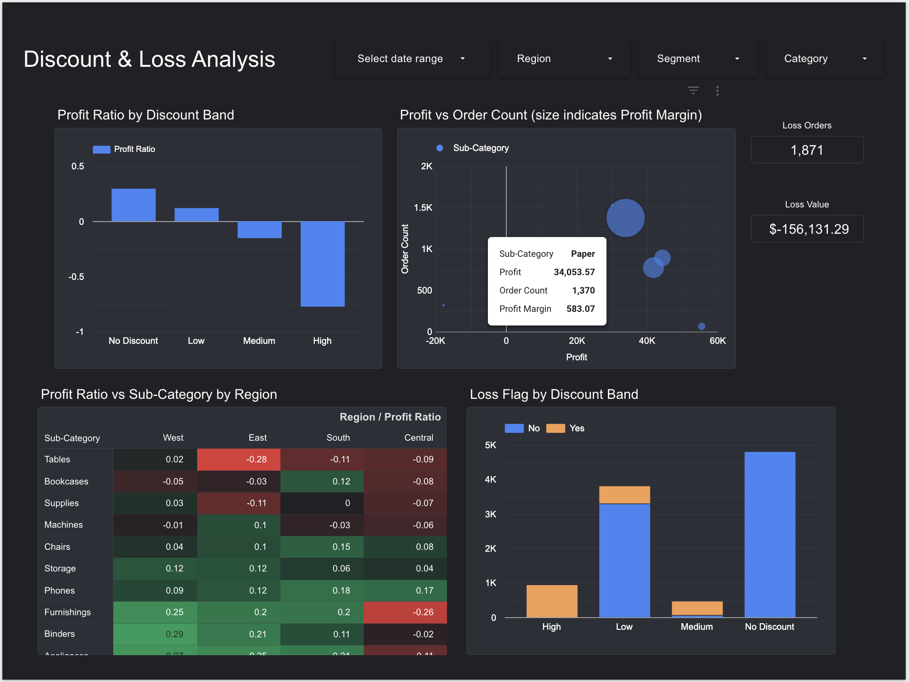
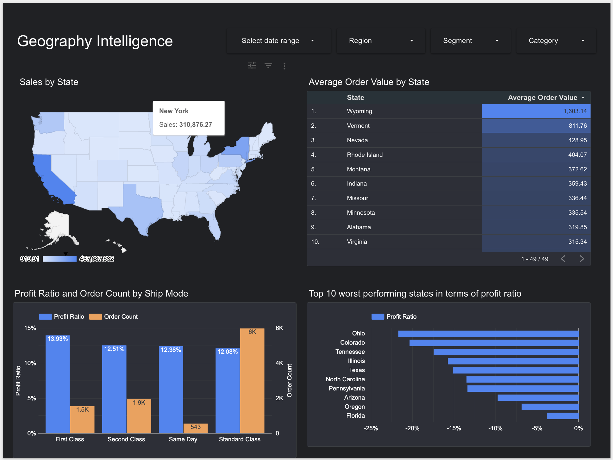

# Superstore Sales Dashboard

An interactive sales analytics dashboard built with Google Sheets, Google Apps Script, JavaScript, and Looker Studio. The project demonstrates end-to-end data pipeline development — from raw data preparation to insight-driven reporting.

## Live Dashboard

[View the Looker Studio Report](https://lookerstudio.google.com/s/ofwgqfgRBfQ)

[Web App for same report](https://script.google.com/macros/s/AKfycbwEerN78wOwCsUP-_o8BjxHntld46XlaiIqatWsHrEH1GNt89nyrfj-R6zVeOc9x8lz/exec)

## Tech Stack

- **Google Sheets** — data storage and source of truth
- **Google Apps Script (JavaScript)** — automated data preparation pipeline
- **Looker Studio** — interactive dashboard and data visualization
- **GitHub** — version control, documentation, and project tracking
- **clasp** — local Apps Script development and deployment

## Business Questions Answered

- How are sales trending year over year?
- Which regions are most profitable relative to their sales volume?
- How do discounts impact profitability?
- Which product sub-categories and regions are driving losses?
- Which states are the worst performers by profit ratio?
- Does shipping method affect profit margins?

## Key Findings

- Sales grew 51% from 2014 to 2017 ($484K → $733K) with consistent Q4 seasonality
- 18.7% of orders are unprofitable, costing $156K in total losses
- High-discount orders lose $0.80 for every $1 in revenue
- Tables in the East region have the worst profit ratio at -28%
- Ohio, Colorado, and Tennessee are the worst performing states
- First Class shipping yields the highest profit margin (13.9%) despite lower volume

## Dashboard Pages

### Executive Overview


Year-on-year sales comparison, profit ratio by region and segment, and key financial scorecards.

### Discount & Loss Analysis


Impact of discounting on profitability, sub-category performance heatmap by region, and loss quantification.

### Geography Intelligence


State-level sales and profitability, average order value by state, shipping efficiency analysis, and worst performing states.

## Project Structure
```
superstore-looker-dashboard/
├── README.md
├── .gitignore
├── docs/
│   ├── dashboard-screenshots/
│   └── run-guide.md
├── data/
│   ├── raw/
│   │   └── Sample-Superstore.csv
│   └── processed/
│       └── data-dictionary.md
├── apps-script/
│   ├── appsscript.json
│   ├── Code.js
│   ├── DataPrep.js
│   └── index.html
├── looker-studio/
│   ├── report-design.md
│   ├── calculated-fields.md
│   └── screenshots/
└── setup/
    ├── setup-checklist.md
    └── deployment-notes.md
```

## What Was Built

### Apps Script Data Pipeline (JavaScript)
- Reads raw order data from the Orders sheet
- Generates six derived fields: Order Year, Order Month, Profit Margin, Discount Band, Loss Flag, Order Count
- Outputs a clean ReportData sheet for Looker Studio consumption
- Custom menu integration for one-click data refresh
- Deployed HTML Service web app with data refresh UI

### Looker Studio Dashboard
- Three analytical pages with interactive cross-filtering
- Calculated fields: Average Order Value, Profit Ratio, Month
- Filtered scorecards isolating loss-making orders
- Conditional formatting heatmap on the sub-category pivot table
- Dual-axis charts, bubble charts, geo maps, and YoY time series

## Setup Instructions

1. Clone this repository
2. Download the Superstore CSV from `data/raw/`
3. Create a Google Sheet named "Superstore Dashboard Data" and import the CSV into an "Orders" tab
4. Open Extensions → Apps Script and paste the code from `apps-script/`
5. Run "Build Report Data" from the Dashboard Tools menu
6. Create a Looker Studio report and connect to the ReportData worksheet
7. Build charts following the design in `looker-studio/report-design.md`

## Author

**Sanjeet Shekhar**
- GitHub: [github.com/Sanjeetshkhr](https://github.com/Sanjeetshkhr)